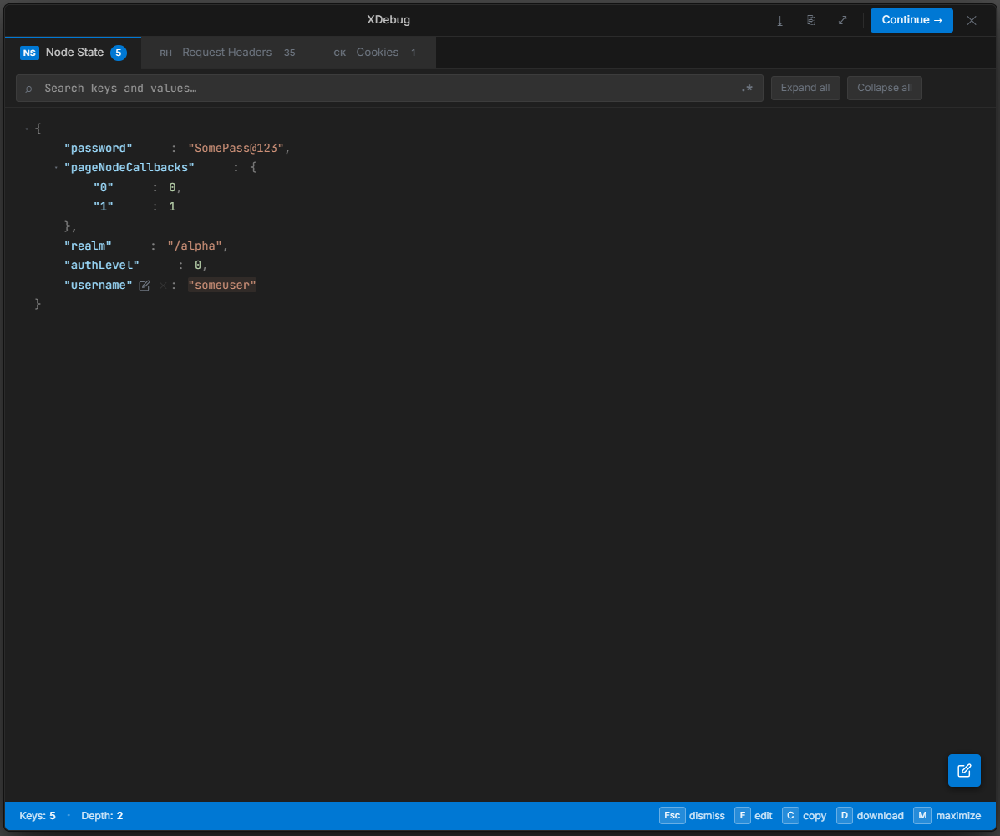
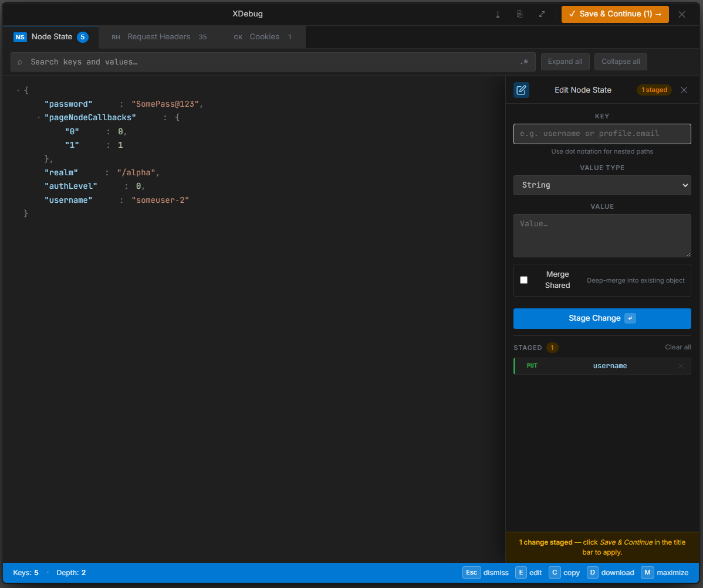

# XDebug Custom Node for PingOne AIC





Ever wished you could **pause a journey mid-flight and edit its state on the fly?** XDebug makes that possible.

A custom node for PingOne Advanced Identity Cloud (AIC) that lets you inspect and manipulate the full journey state in real-time — shared state, transient state, object attributes — all editable without re-running the flow.

## Overview

Drop XDebug into any journey, enable debug mode, and get full visibility into what's happening at that point in the flow. More powerfully, you can **edit the Node State on-the-fly** — change values, add properties, simulate different users or auth levels — and continue the journey with your modified state. No re-runs needed.

## Why Use XDebug?

- **Troubleshooting Journey Flows** - Inspect shared state data at any point in your authentication journey to identify where issues occur
- **JIT State Editing** - Modify any journey variable mid-flow to test different paths without resetting
- **Validating Data Transformations** - Verify that properties and attributes are being transformed correctly as users progress through the journey
- **Testing Custom Logic** - Debug custom decisions and conditional flows by viewing the actual state data
- **Integration Testing** - Confirm that external system integrations are passing correct data to subsequent nodes
- **User Attribute Inspection** - View all user attributes and properties available in the journey context
- **State Tracking** - Track how shared state and node state change through different journey stages

## Files

- **XDebug.nodeTypes.json** - Node type definition with properties and configuration
- **XDebug.nodeTypes.js** - Node implementation script containing the debug logic

---

## Method 1: Import Using Frodo CLI

[Frodo](https://github.com/rockcarver/frodo-cli) is a command-line tool for managing PingOne AIC configurations. Use it to import the XDebug custom node definition.

### Prerequisites

- Frodo CLI installed: `npm install -g @rockcarver/frodo-cli`
- Frodo authenticated with your PingOne AIC environment
- Access to this repository

### Import Steps

1. **Export existing node types** (optional, for backup):
   ```bash
   frodo node export
   ```

2. **Import the XDebug node type**:
   ```bash
   frodo node import -f XDebug.nodeTypes.json
   ```

3. **Verify import** (optional):
   ```bash
   frodo node list
   ```

The XDebug node will now appear in your custom nodes list in the Node Designer.

---

## Method 2: Manual Creation of Custom Node

If you prefer to create the custom node manually through the PingOne AIC UI, follow these steps based on the [PingOne AIC Node Designer Guide](https://docs.pingidentity.com/pingoneaic/journeys/node-designer.html):

### Step 1: Access Custom Nodes

1. In the Advanced Identity Cloud admin console, in either realm, go to **Journeys > Custom Nodes** and click **New Custom Node**.

   **Note:** Custom nodes are global objects and can be accessed from any realm.

---

### Step 2: Details Section

2. In the **Details** section, enter the node information to identify the node in the journey editor:

   | Field | Value |
   |-------|-------|
   | **Name** | XDebug |
   | **Description** | (Optional) XDebug logging node for authentication journeys |
   | **Category** | (Optional) Select a category or leave blank. Your custom node appears under this section in the node list. |
   | **Tags** | (Optional) Add tags to organize the node. For example: `Debug`, `Utilities`, `Logging` |

---

### Step 3: Properties Section

3. In the **Properties** section, add node properties that can be configured when using the node in a journey. Click **Add Property** for each property:

   **Property 1: enabled**
   - **Name:** `enabled` (Used to reference in script via `properties.enabled`)
   - **Label:** `enabled` (Displayed in the node properties panel)
   - **Type:** BOOLEAN
   - **Multi-Valued:** No
   - **Required:** No
   - **Description:** Enable or disable debug output
   - **Provide Default Value:** `true`

---

### Step 4: Settings Section

4. In the **Settings** section, configure the node behavior:

   | Setting | Value |
   |---------|-------|
   | **Outcomes** | `true` (The named outcome paths for the node. You must specify at least one value.) |
   | **Require Script Inputs** | (Leave blank to allow access to all shared and transient state data) |
   | **Require Script Outputs** | (Leave blank to allow the node to set all state data) |
   | **Error Outcome** | (Optional) Enable to add a `Script Error` outcome path if script execution fails |

---

### Step 5: Script Section

5. In the **Script** section, paste the entire contents of `XDebug.nodeTypes.js` into the JavaScript editor.

   Copy and paste the script implementation directly into the inline editor. The script will:
   - Access configured properties via the `properties` binding (e.g., `properties.enabled`, `properties.title`)
   - Use available script bindings like `nodeState`, `action`, and other [Scripted Decision node API](https://docs.pingidentity.com/pingoneaic/am-scripting/scripting-api-node.html) features
   - Define the journey outcome using `action.goTo("true")`

   **Example script structure:**
   ```javascript
   var isEnabled = properties.enabled;
   
   // Perform debug logging or business logic
   logger.debug("XDebug enabled: " + isEnabled);
   
   // Set journey outcome
   action.goTo("true");
   ```

   **Note:** Custom node scripts only appear in the node. You cannot manage these scripts under Scripts > Auth Scripts.

---

### Step 6: Save Your Changes

6. Click **Save** to create the custom node.

   The XDebug node now appears in the node list in the journey editor, ready to be used in your journeys. Custom nodes appear across all realms.

---

### Using the XDebug Node in a Journey

Once saved, you can use the XDebug node in your journeys:

1. Open or create a **Journey**
2. Search for your custom node in the **Nodes** list using the tags, node name, or by expanding the category
3. Drag the **XDebug** node onto your journey canvas
4. Configure node properties:
   - **enabled:** Toggle debug mode on/off
5. Connect the node outcome (`true`) to your next journey step
6. Test and validate the journey

   **Tip:** You can view all journeys that include your custom node in **Custom Nodes > XDebug > Overview**.

---

## Debugging Your Journey with XDebug

### Enable Debug Mode

To view the debug output from the XDebug node:

1. In the Advanced Identity Cloud admin console, open your journey
2. Click **Debug** or **Enable Debug Mode** (typically at the top of the journey canvas)
3. Test your journey by going through the authentication flow
4. When the journey reaches the XDebug node, the debug view displays the Node State data

### Inspect Node State

Once debug mode is enabled and your journey processes the XDebug node:

1. Open the **Node State** panel in the debug view
2. View all available state data, including:
   - **Shared State**: Variables accessible to all nodes in the journey
   - **Transient State**: Temporary variables for the current node
   - **Object Attributes**: User identity attributes (username, email, phone, etc.)
   - **Journey Context**: Realm, session, and callback information


### Example Debug Output

```json
{
  "username": "john.doe@example.com",
  "password": "[encrypted]",
  "realm": "/alpha",
  "objectAttributes": {
    "mail": ["john.doe@example.com"],
    "givenName": ["John"],
    "sn": ["Doe"]
  },
  "authLevel": 1,
  "sessionId": "session-uuid-123456"
}
```

### Edit Node State for JIT Manipulation

One of the most powerful features of the XDebug node is the ability to **edit the Node State on-the-fly during debugging**. This allows you to manipulate journey variables Just-In-Time (JIT) without re-running the entire authentication flow.

#### What You Can Do

In the debug view, you can directly manipulate the Node State:

- **Add** new properties and values to shared state
- **Delete** existing properties from shared state
- **Modify** any property values in real-time
- **Merge** properties or update nested objects
- **View** the complete state as final JSON
- **Test** how subsequent nodes react to the modified state

#### How to Use the Debug Interface

1. **Click "Edit Node State"** - This opens the editable state panel where you can add, modify, or delete properties
2. **Make your changes** - Update property values directly in the editor
3. **Merge State** (optional) - Use the "Merge State" checkbox to merge multiple properties or nested objects
4. **Stage Changes** - Click the **Stage Change** button to prepare your modifications
5. **Save & Continue** - Click the **"Save & Continue"** button (visible at the top of the debug panel) to persist your changes and continue the journey


**Important:** Changes to the Node State are **only persisted when you click "Save and Continue"**. If you close the debug view or navigate away without saving, all modifications to the state will be lost and the journey will revert to the original state. You'll see a warning message indicating staged changes that need to be saved.

#### Use Cases for JIT Manipulation

- **Test Conditional Flows** - Change `authLevel` to test different authentication paths without resetting
- **Simulate Different Users** - Modify `username` and `objectAttributes` to test user-specific logic
- **Test Error Scenarios** - Remove or corrupt state data to verify error handling
- **Skip Authentication Steps** - Set required flags to bypass certain journey nodes
- **Test Integrations** - Modify external system responses without re-calling the APIs
- **Verify State Transformations** - Edit shared state after a node executes to see how subsequent nodes react

#### Example: JIT Testing Different Authentication Levels

```
Initial State:
  "authLevel": 0

Edit During Debug:
  Change "authLevel" to 2 (simulate MFA completed)
  
Result:
  Journey conditionals checking "authLevel > 1" 
  now execute the MFA-completed path without 
  having to actually complete MFA again
```

#### Example: Test with Different User Attributes

```
1. Initial Debug Run:
   "objectAttributes": {
     "mail": ["user@standard.com"],
     "group": ["users"]
   }

2. Edit in Debug Mode:
   - Click on objectAttributes
   - Change "group" to ["admins"]

3. Instant Test:
   Journey logic that checks group membership 
   now proceeds as an admin without re-authenticating
```

### Best Practices

- **Place XDebug nodes strategically** - Add XDebug nodes after decision nodes or identity store lookups to verify data flow
- **Leverage JIT Editing** - Use state editing to rapidly test different scenarios and edge cases
- **Test Error Conditions** - Intentionally break state data to verify error handling in subsequent nodes
- **Disable before production** - Set `enabled` to `false` or remove the node before deploying to production
- **Clean up logs** - Avoid logging sensitive data; use ESV (Environment-Scoped Variables) for secrets
- **Document test scenarios** - Keep notes on the state modifications you used to test specific conditions

---

## Reference Documentation

For more details on creating custom nodes in PingOne AIC, refer to:
- [PingOne AIC Node Designer Guide](https://docs.pingidentity.com/pingoneaic/journeys/node-designer.html)

---

## File Structure Example

```
p1aic-xdebug/
├── README.md
├── XDebug.nodeTypes.json      # Node definition
├── XDebug.nodeTypes.js        # Implementation script
└── docs/
    └── images/
        ├── debug-output.png           # Node State inspector screenshot
        └── debug-edit-mode.png        # Edit mode with Save & Continue screenshot
```

---

## Troubleshooting

**Node not appearing in the node list after creation:**
- Verify you clicked **Save** to complete node creation
- Refresh the journey editor page
- Verify the node name and properties are correctly configured

**Script errors when using the node:**
- Check the browser developer console for error messages
- Verify the JavaScript syntax in your node script
- Ensure all referenced properties are defined in the node configuration

**Frodo import fails:**
- Verify Frodo authentication: `frodo info`
- Check JSON file is valid: `jq . XDebug.nodeTypes.json`
- Review Frodo logs for detailed error messages

---

## Support

For issues or questions:
1. Check the [PingOne AIC documentation](https://docs.pingidentity.com/pingoneaic/)
2. Review node definition in `XDebug.nodeTypes.json`
3. Verify script implementation in `XDebug.nodeTypes.js`
